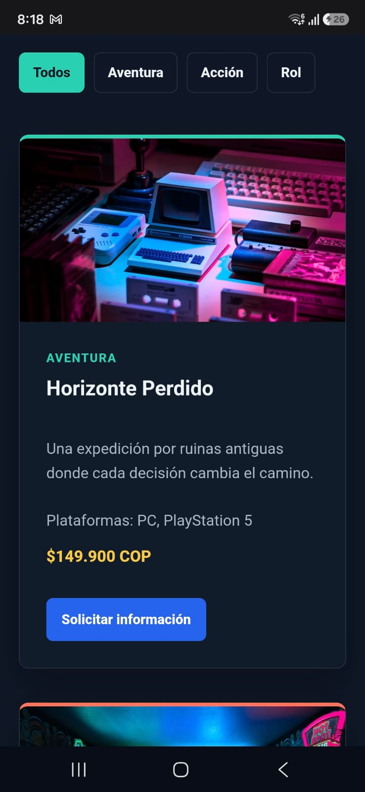

# Pixel Forge

Pixel Forge es una tienda independiente de videojuegos pensada para personas que quieren descubrir juegos nuevos y consultar su disponibilidad antes de reservarlos. El catálogo relaciona videojuegos con sus categorías, plataformas y solicitudes de clientes. Así, el proyecto puede crecer después hacia una API REST con recursos de juegos, categorías y reservas.

## Enlaces

- Repositorio: https://github.com/Ruales1138/Tienda-de-Juegos
- Sitio en Vercel: https://tienda-de-juegos-e50d5q980-ruales.vercel.app/

## Capturas

### Escritorio

### Móvil

## Decisiones técnicas

**HTML y CSS.** La página usa `header`, `nav`, `main`, `section` y `footer` para separar las partes principales. El catálogo usa CSS Grid porque necesita distribuir tarjetas en columnas que cambian según el ancho de pantalla. El menú, la barra de filtros y los formularios usan Flexbox porque allí importa alinear elementos y permitir que se acomoden en una fila o varias.

**JavaScript.** El catálogo se construye a partir del arreglo `juegos`, por lo que las tarjetas y las opciones del formulario se generan desde una misma fuente de datos. También se puede filtrar por categoría, abrir y cerrar el menú móvil y cambiar entre modo oscuro y claro. La preferencia del tema se guarda en `localStorage` para conservarla al volver a la página.

**Validación.** El formulario no se envía si el nombre tiene menos de dos caracteres, el correo no tiene un formato válido, no se seleccionó un videojuego o el mensaje tiene menos de diez caracteres. Cada error aparece junto al campo correspondiente y el formulario indica cuando la consulta está lista.

**Uso de IA.** Usé IA como apoyo para revisar requisitos, detectar elementos que faltaban y proponer mejoras de accesibilidad. Revisé y adapté el resultado al proyecto: escogí el contenido de Pixel Forge, ajusté los colores, escribí los textos y comprobé el funcionamiento del filtro, el formulario y el menú.

**Lo más difícil.** Lo más difícil fue coordinar el catálogo generado dinámicamente con el formulario y los filtros sin repetir nombres de videojuegos. Lo resolví usando un solo arreglo de objetos y funciones pequeñas que reutilizan esos datos para crear tarjetas, opciones y resultados filtrados.

## Tecnologías

- HTML5 semántico
- CSS3 con variables, Flexbox, Grid y media queries
- JavaScript puro, sin frameworks

## Ejecución local

Abre `index.html` en un navegador. No necesita instalación ni dependencias externas. Las imágenes del catálogo se cargan desde Unsplash.
